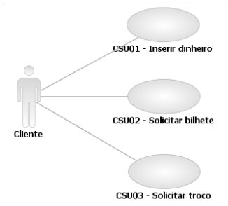

# 1. Engenharia de Requisitos
As estações de trem frequentemente fornecem máquinas de vender bilhetes que
imprimem um bilhete quando um cliente insere a quantia correta para pagar a
passagem. As máquinas mantêm uma soma total da quantidade de dinheiro que 
coletou durante toda sua operação.

## 1.1. *Catálogo dos Atores*
| **Ator** | **Descrição**                         |
|----------|---------------------------------------|
| Cliente  | Usuário da máquina de vender bilhetes |

## *1.2. Diagramas de caso de uso*

## *1.3. Especificação dos casos de uso*

### 1.3.1. CSU01 - Inserir dinheiro
| **Identificador**      | CSU01                                                                                                                                           |
|------------------------|-------------------------------------------------------------------------------------------------------------------------------------------------|
| **Nome**               | Inserir dinheiro                                                                                                                                |
| **Atores**             | Cliente                                                                                                                                         |
| **Sumário**            | Uma quantia de dinheiro é inserida na máquina. É importante ressaltar que essa quantia sempre é representada por uma única nota de papel-moeda. |
| **Complexidade**       | Médio                                                                                                                                           |
| **Regras de Negócio**  | N/D                                                                                                                                             |
| **Pré-Condições**      | N/D                                                                                                                                             |
| **Pós-Condição**       | O valor inserido é adicionado ao saldo total disponível.                                                                                        |
| **Pontos de Inclusão** | N/D                                                                                                                                             |
| **Pontos de Extensão** | N/D                                                                                                                                             |

### 1.3.2 CSU02 - Solicitar bilhete

| **Identificador**      | CSU02                                                             |
|------------------------|-------------------------------------------------------------------|
| **Nome**               | Solicitar bilhete                                                 |
| **Atores**             | Cliente                                                           |
| **Sumário**            | Um único bilhete de transporte é impresso.                        |
| **Complexidade**       | Fácil                                                             |
| **Regras de Negócio**  | N/D                                                               |
| **Pré-Condições**      | N/D                                                               |
| **Pós-Condição**       | Um bilhete é impresso e seu valor é debitado do saldo disponível. |
| **Pontos de Inclusão** | N/D                                                               |
| **Pontos de Extensão** | N/D                                                               |

### 1.3.3 CSU03 - Solicitar troco
| **Identificador**      | CSU03                                                                            |
|------------------------|----------------------------------------------------------------------------------|
| **Nome**               | Solicitar troco                                                                  |
| **Atores**             | Cliente                                                                          |
| **Sumário**            | O troco é devolvido. Vale ressaltar que o troco também é em nota de papel-moeda. |
| **Complexidade**       | Fácil                                                                            |
| **Regras de Negócio**  | N/D                                                                              |
| **Pré-Condições**      | N/D                                                                              |
| **Pós-Condição**       | O valor em nota de papel-moeda é devolvido e o saldo disponível é zerado.        |
| **Pontos de Inclusão** | N/D                                                                              |
| **Pontos de Extensão** | N/D                                                                              |